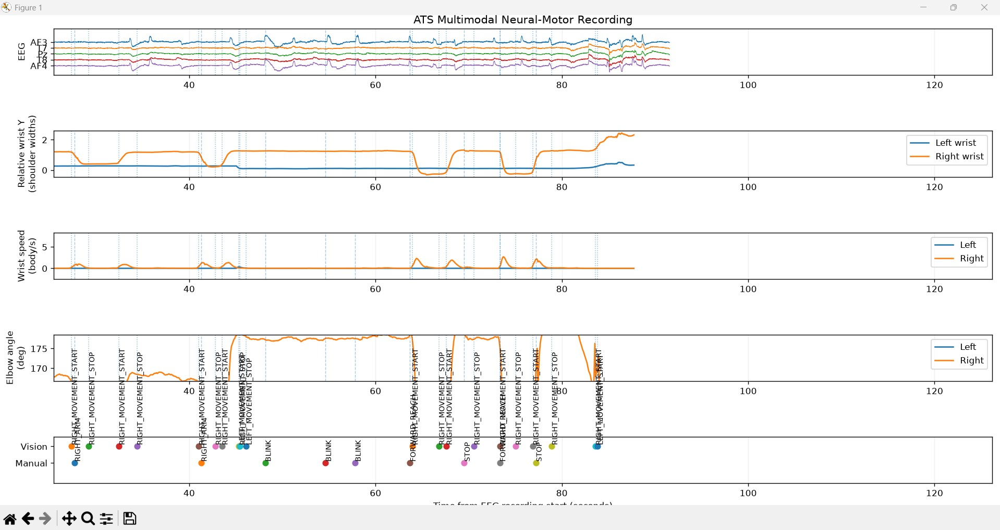
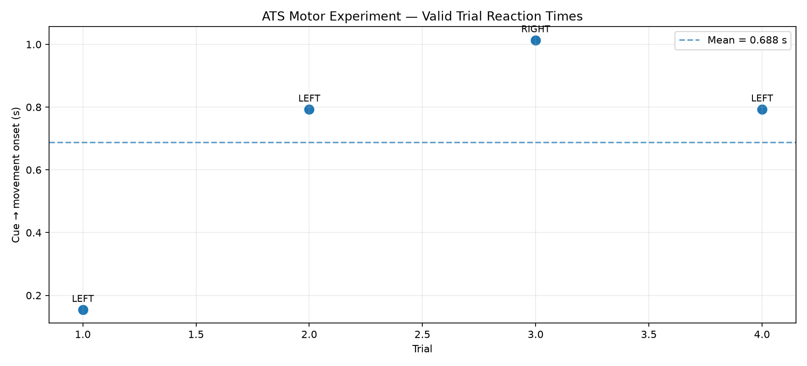
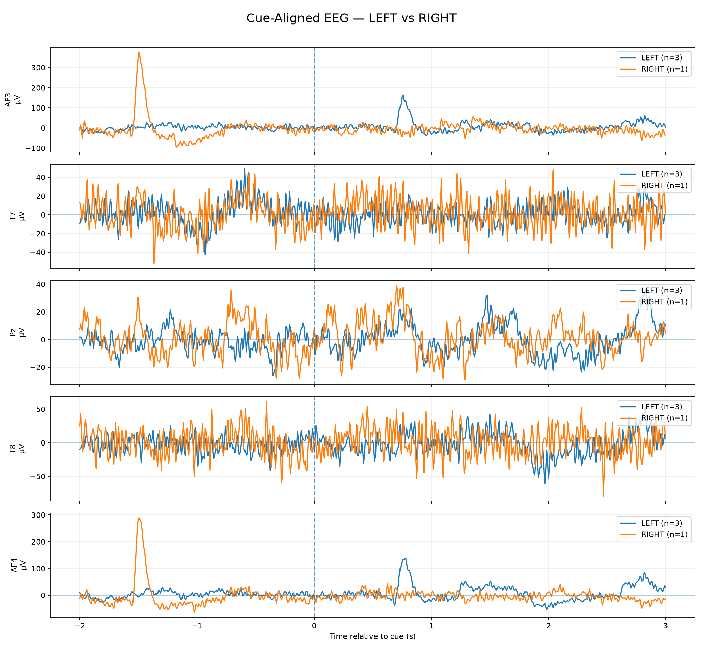
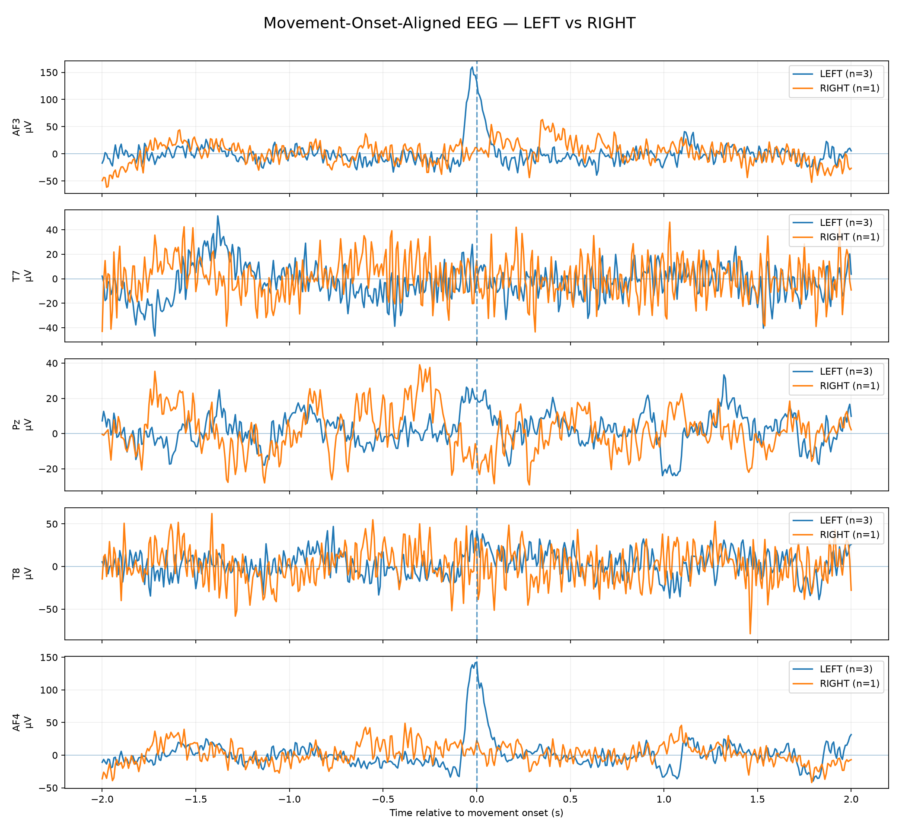
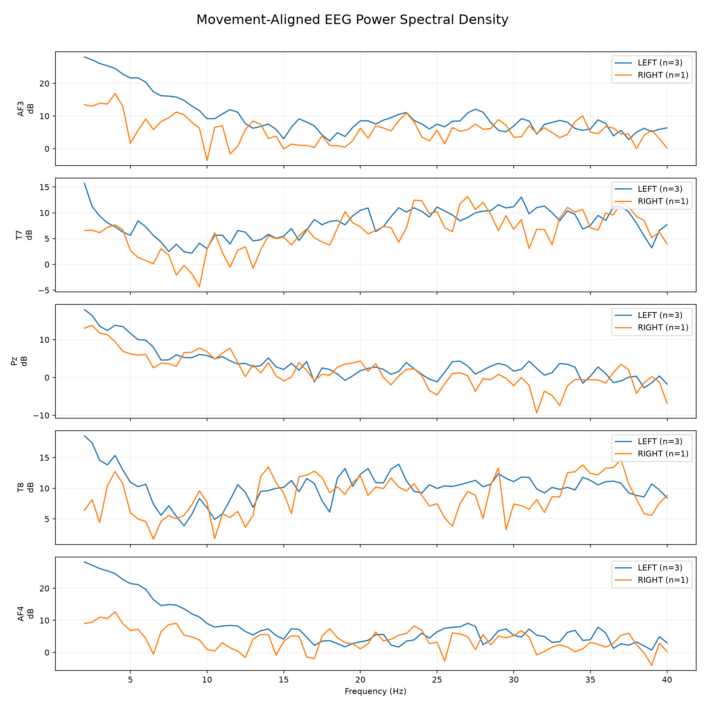

# Multimodal Neural-Motor Sensing

A multimodal experimental platform for synchronising neural signals, behavioural events and vision-derived human motion within a common recording and analysis pipeline.

The system was developed to explore how temporally aligned biological and physical measurements can be used to study human motor behaviour and provide a foundation for future multimodal state-estimation systems.

> **Status:** Active experimental prototype. Current datasets are exploratory and are not intended to support neuroscientific conclusions.

<p align="center">
  
</p>

*Example synchronised recording showing EEG alongside vision-derived upper-limb kinematics and behavioural event markers.*

---

## System Overview

The platform combines independently generated neural, behavioural and physical-observation streams using **Lab Streaming Layer (LSL)**. Selected streams can be recorded together into **XDF**, then validated and analysed offline using **MNE-Python** and the accompanying analysis tools.

```text
                              WORKSTATION

                    ┌────────────────────┐
                    │   Emotiv Insight   │
                    │    5-ch EEG        │
                    └─────────┬──────────┘
                              │ Cortex
                              ▼
                       ATS_EEG_RAW
                              │
                              │
┌────────────────────┐        │        ┌─────────────────────┐
│ Experiment / Cues  │        │        │ Manual annotation   │
│  ATS_EXPERIMENT    │        │        │    ATS_MARKERS      │
└──────────┬─────────┘        │        └──────────┬──────────┘
           │                  │                   │
           └──────────────────┼───────────────────┘
                              │
                              │ LSL network
                              │
              ┌───────────────┴────────────────┐
              │                                │
              │                        NVIDIA JETSON NANO
              │
              │                     ┌─────────────────────┐
              │                     │ CSI camera          │
              │                     │ PoseNet inference   │
              │                     │ kinematics          │
              │                     │ movement detection  │
              │                     └──────────┬──────────┘
              │                                │
              │                     ┌──────────┴──────────┐
              │                     ▼                     ▼
              │              ATS_BODY_POSE       ATS_VISION_EVENTS
              │                     │                     │
              └─────────────────────┴─────────────────────┘
                                    │
                                    ▼
                               LSL / XDF
                                    │
                     ┌──────────────┴──────────────┐
                     ▼                             ▼
              Trial validation             Multimodal plotting
                     │
                     ▼
              Validated trials
                     │
              ┌──────┴────────┐
              ▼               ▼
         Cue-aligned     Movement-aligned
            epochs           epochs
              │               │
              └──────┬────────┘
                     ▼
                  MNE analysis
                     │
          ┌──────────┼───────────┐
          ▼          ▼           ▼
      EEG averages   PSD     Time-frequency
```

The Jetson is an optional networked edge node: workstation-side acquisition, experiment control and offline analysis can still be used independently.

---

## Current Capabilities

The current prototype supports:

- live 5-channel EEG acquisition from an Emotiv Insight through the Cortex API
- EEG publication as `ATS_EEG_RAW`
- manual timestamped markers through `ATS_MARKERS`
- randomised LEFT / RIGHT motor-response experiments through `ATS_EXPERIMENT`
- NVIDIA Jetson Nano edge perception using PoseNet
- 32-channel body-pose / kinematic publication through `ATS_BODY_POSE`
- vision-derived movement and trial-state events through `ATS_VISION_EVENTS`
- body-relative wrist coordinates and velocity
- elbow-angle estimation
- rolling movement-displacement detection
- automatic neutral-pose calibration and per-arm trial state tracking
- cross-machine LSL stream discovery
- XDF recording and inspection
- behavioural validation of commanded trials against observed movement
- reaction-time calculation
- cue-aligned and movement-onset-aligned EEG epoch generation
- EEG filtering and mains-frequency rejection
- power spectral density analysis
- time-frequency / ERD-ERS visualisation
- synchronised multimodal timeline visualisation

---

## LSL Streams

| Stream | Host | Type | Contents |
|---|---|---|---|
| `ATS_EEG_RAW` | Workstation | EEG | AF3, T7, Pz, T8, AF4 at nominal 128 Hz |
| `ATS_MARKERS` | Workstation | Markers | Manual behavioural / experimental annotations |
| `ATS_EXPERIMENT` | Workstation | Markers | Automatic motor-task cues, phases and trial events |
| `ATS_BODY_POSE` | Jetson | Pose | 32-channel pose, kinematic and trial-state data |
| `ATS_VISION_EVENTS` | Jetson | Markers | Vision-derived movement and trial-state events |

Irregular streams are timestamped when samples or events are produced rather than being assigned a fixed nominal sample rate.

---

# Quick Start

## 1. Clone the repository

```bash
git clone https://github.com/alexandershaw03/multimodal-sensing.git
cd multimodal-sensing
```

## 2. Create a workstation Python environment

The workstation-side acquisition, validation and analysis tools require **Python 3.10+**.

### Windows PowerShell

```powershell
python -m venv .venv
.\.venv\Scripts\Activate.ps1
python -m pip install --upgrade pip
pip install -r requirements.txt
```

### Linux / macOS

```bash
python3 -m venv .venv
source .venv/bin/activate
python -m pip install --upgrade pip
pip install -r requirements.txt
```

The Jetson edge node uses NVIDIA platform libraries and is documented separately in [`docs/jetson_edge_node.md`](docs/jetson_edge_node.md).

---

## 3. Configure local Cortex credentials

Copy the example environment file:

### Windows PowerShell

```powershell
Copy-Item .env.example .env
```

### Linux / macOS

```bash
cp .env.example .env
```

Edit `.env` locally:

```text
EMOTIV_CLIENT_ID=your_client_id
EMOTIV_CLIENT_SECRET=your_client_secret
```

Optionally configure a local experimental-data directory:

```text
ATS_DATA_ROOT=C:\path\to\your\data
```

The real `.env` file is intentionally excluded from Git. **Do not commit Cortex credentials to the repository.**

EEG acquisition also requires the local EMOTIV Cortex service to be running and an authorised Emotiv Insight headset to be available.

---

# Running the Platform

## Live EEG

Start the Cortex-to-LSL bridge:

```bash
python acquisition/eeg_lsl_stream.py
```

Optional diagnostics:

```bash
python acquisition/eeg_lsl_stream.py --debug
```

The bridge publishes:

```text
ATS_EEG_RAW
AF3, T7, Pz, T8, AF4
Nominal rate: 128 Hz
```

---

## Manual event markers

For manual annotations:

```bash
python acquisition/marker_stream.py
```

This publishes `ATS_MARKERS`.

Available marker commands include:

```text
REST
LEFT_ARM
RIGHT_ARM
FORWARD_REACH
BLINK
STOP
```

---

## Automatic motor experiment

Run the randomised LEFT / RIGHT task:

```bash
python experiments/motor_task.py
```

The experiment publishes `ATS_EXPERIMENT` and writes a local CSV backup log.

If `ATS_DATA_ROOT` is set, experiment logs are written beneath that directory unless `--log-dir` is supplied explicitly.

---

## Jetson edge perception

The NVIDIA Jetson Nano runs:

```bash
python edge/pose_estimation_node.py
```

The node performs PoseNet inference, derives body-normalised upper-limb kinematics, detects movement and publishes:

```text
ATS_BODY_POSE
ATS_VISION_EVENTS
```

Headless operation is available:

```bash
python edge/pose_estimation_node.py --headless
```

Jetson platform setup, timing behaviour, stream schema and limitations are documented in:

[`docs/jetson_edge_node.md`](docs/jetson_edge_node.md)

---

## Discover live streams

From any machine on the LSL network:

```bash
python tools/discover_lsl_streams.py --ats-only
```

The utility reports stream name, type, channel count, nominal rate and publishing hostname. This is useful for verifying the distributed workstation / Jetson architecture.

---

# Recording

The live LSL streams can be recorded together using **LabRecorder** or another XDF-compatible LSL recorder.

A representative motor experiment may contain:

```text
ATS_EEG_RAW
ATS_EXPERIMENT
ATS_BODY_POSE
ATS_VISION_EVENTS
```

`ATS_MARKERS` can additionally be recorded when manual annotation is required.

Raw participant recordings are intentionally excluded from this public repository.

---

# Inspecting and Analysing XDF

## Inspect an XDF recording

```bash
python tools/inspect_xdf.py recording.xdf
```

This reports stream names, data dimensions, duration, nominal sample rates and timestamp-derived rates.

---

## Plot the multimodal timeline

```bash
python analysis/plot_multimodal_xdf.py recording.xdf
```

Optional windowed view:

```bash
python analysis/plot_multimodal_xdf.py recording.xdf --start 20 --end 50 --show
```

The plotter supports the current `ATS_EXPERIMENT` event stream and legacy/manual `ATS_MARKERS` recordings, and resolves pose channels from the recorded stream schema.

---

## Validate motor trials

```bash
python validation/validate_motor_trials.py recording.xdf
```

The validator compares commanded LEFT / RIGHT trials against independently detected vision events and writes:

```text
recording_validated_trials.csv
```

By default, the expected UP response determines overall trial validity. To require both UP and DOWN movement validation:

```bash
python validation/validate_motor_trials.py recording.xdf --require-down-valid
```

---

## Analyse validated EEG

After validation:

```bash
python analysis/analyse_validated_motor_eeg.py recording.xdf
```

If the validation CSV has the default name beside the XDF, it is discovered automatically.

Typical outputs include:

```text
reaction-time plot
cue-aligned EEG averages
movement-aligned EEG averages
movement-aligned PSD
cue-aligned time-frequency maps
movement-aligned time-frequency maps
MNE Epochs
analysis summary
```

Use:

```bash
python analysis/analyse_validated_motor_eeg.py recording.xdf --show
```

to display figures interactively after saving.

---

## Convert EEG + manual markers to MNE FIF

For recordings containing `ATS_EEG_RAW` and `ATS_MARKERS`:

```bash
python analysis/xdf_to_mne.py recording.xdf
```

The converter writes an MNE-compatible `.fif` file and can optionally open the MNE raw-data viewer with `--show`.

---

# Repository Structure

```text
multimodal-sensing/
│
├── acquisition/
│   ├── eeg_lsl_stream.py
│   └── marker_stream.py
│
├── experiments/
│   └── motor_task.py
│
├── edge/
│   └── pose_estimation_node.py
│
├── validation/
│   └── validate_motor_trials.py
│
├── analysis/
│   ├── xdf_to_mne.py
│   ├── plot_multimodal_xdf.py
│   └── analyse_validated_motor_eeg.py
│
├── tools/
│   ├── discover_lsl_streams.py
│   ├── inspect_xdf.py
│   └── read_eeg_stream.py
│
├── docs/
│   ├── synchronisation.md
│   └── jetson_edge_node.md
│
├── media/
├── results/
├── .env.example
├── .gitignore
├── requirements.txt
├── LICENSE
└── README.md
```

---

# Representative Results

The figures below are included primarily as evidence that the acquisition, synchronisation, validation and analysis pipeline operates end-to-end. The current recording is exploratory and is not intended to support neuroscientific conclusions.

## Behavioural Validation

<p align="center">
  
</p>

Four of six commanded trials were behaviourally validated in the current example recording. Movement onset was independently estimated from the motion stream, allowing cue-to-movement reaction time to be calculated.

## Cue-Aligned EEG

<p align="center">
  
</p>

Validated EEG epochs aligned to the experimental cue.

## Movement-Onset-Aligned EEG

<p align="center">
  
</p>

The same validated trials independently aligned to detected physical movement onset rather than the commanded cue.

## Spectral Analysis

<p align="center">
  
</p>

Movement-aligned power spectral density analysis across the five EEG channels.

Additional cue- and movement-aligned time-frequency analyses are available in [`results/`](results/).

---

## Example Experiment

A motor-response experiment was used to test the end-to-end pipeline.

The system presented LEFT or RIGHT movement cues and recorded the corresponding EEG and observed movement. Trials were subsequently validated by checking whether the detected movement matched the commanded action.

A representative exploratory recording contained:

```text
Commanded trials:       6
Behaviourally valid:    4
LEFT trials:            3
RIGHT trials:           1
Mean reaction time:     0.6885 s
Minimum:                0.1543 s
Maximum:                1.0136 s
```

The dataset is intentionally small and is used to validate the acquisition and analysis architecture rather than draw neuroscientific conclusions.

---

# EEG Processing

Current exploratory processing includes:

```text
Band-pass:    1–40 Hz
Mains notch:  50 Hz
```

Validated trials can be transformed into both cue-aligned and movement-onset-aligned MNE Epochs.

This allows neural activity to be compared against both the intended experimental event and the independently observed physical response.

Behavioural validation confirms that the expected physical movement occurred; it does **not** constitute EEG artefact rejection.

---

# Synchronisation

The current architecture uses **software-level LSL synchronisation**.

EEG, experiment, marker and vision processes publish into a common LSL/XDF timing framework, but the present system does not use a shared hardware trigger across every sensor.

For the Jetson vision node, the LSL timestamp associated with a processed camera frame is software-side rather than a camera-sensor hardware timestamp.

Potential timing uncertainty therefore includes:

```text
sensor / headset transport latency
camera exposure and buffering
vision processing latency
OS scheduling
network timing
```

The architecture and limitations are documented in more detail in:

[`docs/synchronisation.md`](docs/synchronisation.md)

Quantitative end-to-end synchronisation-error characterisation is planned future work.

---

# Why Multimodal?

EEG alone provides an incomplete description of behaviour.

By recording neural activity alongside explicit experiment events and independently observed physical movement, the system can distinguish between:

```text
command issued
      ↓
neural activity
      ↓
movement initiation
      ↓
observed physical motion
```

This provides a foundation for future work in multimodal state estimation, sensor fusion and neural-motor modelling.

---

# Technologies

### Languages

- Python

### Acquisition & Synchronisation

- Lab Streaming Layer (LSL)
- XDF
- LabRecorder
- Emotiv Cortex API

### Edge Perception

- NVIDIA Jetson Nano
- jetson-inference
- PoseNet
- TensorRT-backed inference
- CSI camera input

### Signal Processing

- MNE-Python
- NumPy
- SciPy
- pandas

### Visualisation

- Matplotlib

### Sensing

- EEG
- computer vision / pose-derived kinematics
- timestamped behavioural events

---

# Current Limitations

This is an experimental engineering platform rather than a validated neuroscience study.

Current limitations include:

- small experimental datasets
- limited EEG channel count
- 2-D pose-derived movement measurements rather than calibrated laboratory motion capture
- first-detected-person tracking rather than persistent subject identity
- software-side camera timestamps rather than sensor hardware timestamps
- software-level multimodal synchronisation rather than a shared hardware trigger
- uncharacterised camera / inference latency
- experimentally selected movement thresholds
- behavioural validation does not constitute EEG artefact rejection

These limitations are exposed explicitly so that future iterations can quantify or remove them.

---

# Planned Development

Current development priorities include:

- quantitative end-to-end synchronisation-error characterisation
- Jetson perception-latency and throughput benchmarking
- hardware-assisted event synchronisation
- embedded-system telemetry as an additional LSL stream
- inertial-sensor fusion and cross-modal movement validation
- persistent subject tracking for multi-person scenes
- larger balanced experimental datasets
- improved EEG artefact rejection
- learned multimodal state-estimation models

Selected development tasks are tracked through GitHub Issues.

---

# Project Context

This project developed from earlier work on a real-time EEG-controlled mobile robot and is part of a broader investigation into systems that connect biological sensing, perception, embedded computation and physical behaviour.

The immediate focus is the engineering infrastructure required to acquire, synchronise, validate and analyse heterogeneous sensor streams reliably.

---

# License

This project is released under the **MIT License**. See [`LICENSE`](LICENSE) for details.
